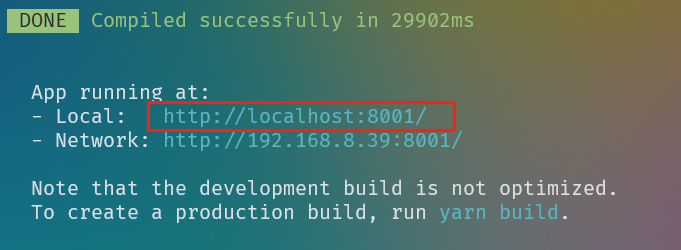
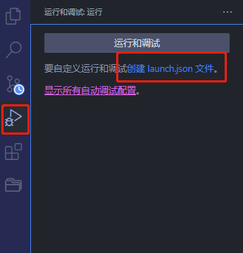
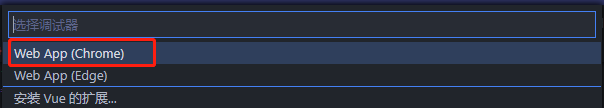
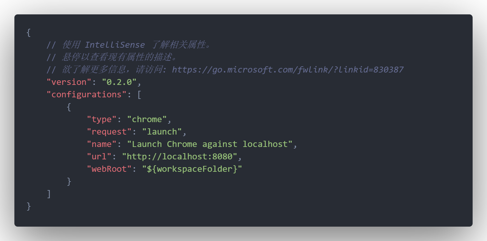
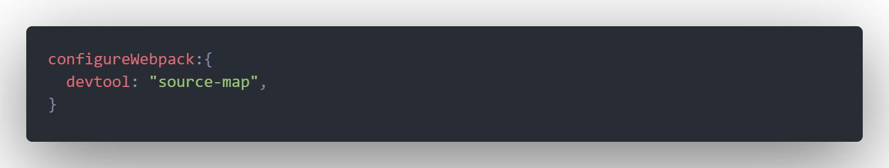
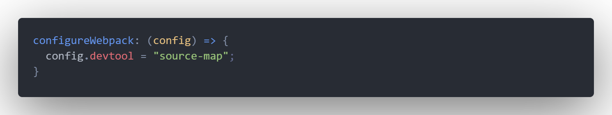
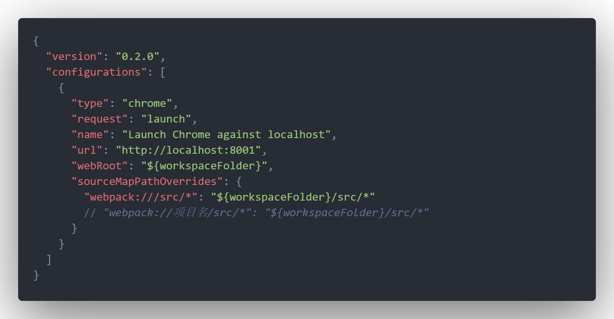
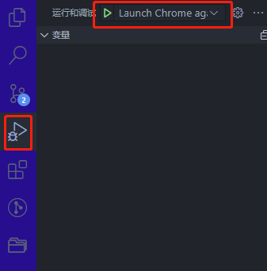

# VSCode调试Vue2项目配置教程

## 创建调试配置文件

### 启动项目

```powershell
yarn serve
```

终端如下图所示



将本地启动的url记录下来。

### 创建launch.json

进入VS Code软件，点击调试，点击创建 launch.json 文件。



选择需要支持的浏览器类型。



VS Code在项目目录->.vscode文件夹中创建launch.json。内容如下。



将configurations中的url替换成第一步记录的url：`http://localhost:8001`。

## 配置vue.config.js文件

配置configureWebpack的devtool为`source-map`

### 情况一

按如下配置。



### 情况二

按如下配置。



## 映射打包目录和项目目录

在浏览器按F12打开调试，打开打包的一个页面，查看该页面路径。存在两种情况，如下图。


在.vscode文件夹中优化launch.json，将webpack打包的文件目录和实际项目目录对应。



完成配置。

## 启动调试

点击VS Code中的开始调试。



## 小结

在VS Code中的优点：

1. 直接在代码里面打断点。不需要在浏览器中找页面。

2. 能直接查看当前的内存堆栈调用，能监听变量变化。变量内容显示比浏览器详细的多。

主要是极大地方便了js逻辑调试，样式调试还是和浏览器一样。
