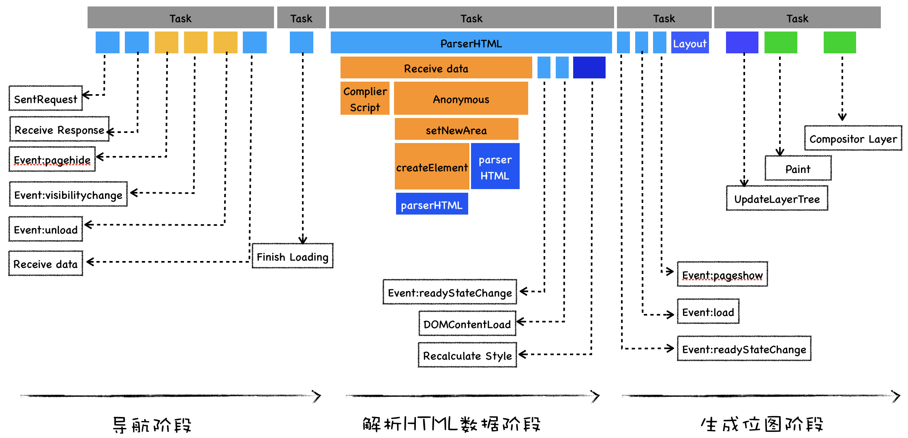
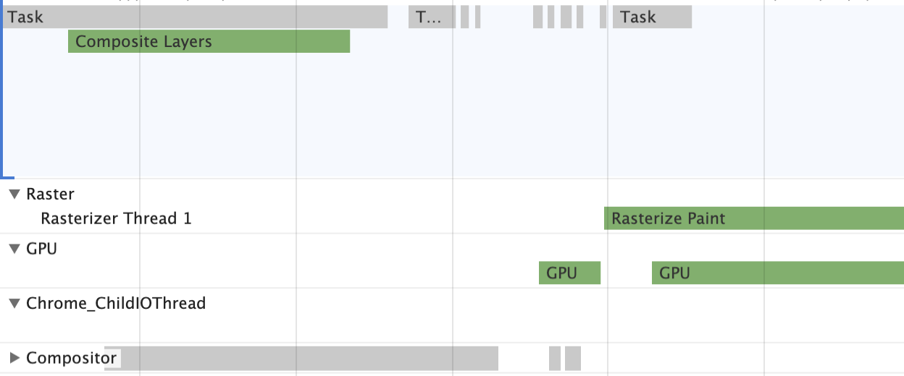

# 加餐五 | 性能分析工具：如何分析 Performance 中的 Main 指标？

上节我们介绍了如何使用 Performance，而且我们还提到了性能指标面板中的 Main 指标，它详细地记录了渲染主线程上的任务执行记录，通过分析 Main 指标，我们就能够定位到页面中所存在的性能问题，本节，我们就来介绍如何分析 Main 指标。

## 任务 vs 过程

不过在开始之前，我们要讲清楚两个概念，那就是 Main 指标中的任务和过程，在《15 | 消息队列和事件循环：页面是怎么活起来的？》和《加餐二｜任务调度：有了 setTimeOut，为什么还要使用 rAF？》这两节我们分析过，渲染进程中维护了消息队列，如果通过 SetTimeout 设置的回调函数，通过鼠标点击的消息事件，都会以任务的形式添加消息队列中，然后任务调度器会按照一定规则从消息队列中取出合适的任务，并让其在渲染主线程上执行。

而我们今天所分析的 Main 指标就记录渲染主线上所执行的全部任务，以及每个任务的详细执行过程。

你可以打开 Chrome 的开发者工具，选择 Performance 标签，然后录制加载阶段任务执行记录，然后关注 Main 指标，如下图所示：


观察上图，图上方有很多一段一段灰色横条，每个灰色横条就对应了一个任务，灰色长条的长度对应了任务的执行时长。通常，渲染主线程上的任务都是比较复杂的，如果只单纯记录任务执行的时长，那么依然很难定位问题，因此，还需要将任务执行过程中的一些关键的细节记录下来，这些细节就是任务的过程，灰线下面的横条就是一个个过程，同样这些横条的长度就代表这些过程执行的时长。

直观地理解，你可以把任务看成是一个 Task 函数，在执行 Task 函数的过程中，它会调用一系列的子函数，这些子函数就是我们所提到的过程。为了让你更好地理解，我们来分析下面这个任务的图形：


观察上面这个任务记录的图形，你可以把该图形看成是下面 Task 函数的执行过程：

```js
function A() {
  A1();
  A2();
}
function Task() {
  A();
  B();
}
Task();
```

结合代码和上面的图形，我们可以得出以下信息：

- Task 任务会首先调用 A 过程；
- 随后 A 过程又依次调用了 A1 和 A2 过程，然后 A 过程执行完毕；
- 随后 Task 任务又执行了 B 过程；
- B 过程执行结束，Task 任务执行完成；
- 从图中可以看出，A 过程执行时间最长，所以在 A1 过程时，拉长了整个任务的执行时长。

## 分析页面加载过程

通过以上介绍，相信你已经掌握了如何解读 Main 指标中的任务了，那么接下来，我们就可以结合 Main 指标来分析页面的加载过程。我们先来分析一个简单的页面，代码如下所示：

```html
<html>
  <head>
    <title>Main</title>
    <style>
      area {
        border: 2px ridge;
      }

      box {
        background-color: rgba(106, 24, 238, 0.26);
        height: 5em;
        margin: 1em;
        width: 5em;
      }
    </style>
  </head>

  <body>
    <div class="area">
      <div class="box rAF"></div>
    </div>
    <br />
    <script>
      function setNewArea() {
        let el = document.createElement("div");
        el.setAttribute("class", "area");
        el.innerHTML = '<div class="box rAF"></div>';
        document.body.append(el);
      }
      setNewArea();
    </script>
  </body>
</html>
```

观察这段代码，我们可以看出，它只是包含了一段 CSS 样式和一段 JavaScript 内嵌代码，其中在 JavaScript 中还执行了 DOM 操作了，我们就结合这段代码来分析页面的加载流程。

首先生成报告页，再观察报告页中的 Main 指标，由于阅读实际指标比较费劲，所以我手动绘制了一些关键的任务和其执行过程，如下图所示：



通过上面的图形我们可以看出，加载过程主要分为三个阶段，它们分别是：

1. 导航阶段，该阶段主要是从网络进程接收 HTML 响应头和 HTML 响应体。
2. 解析 HTML 数据阶段，该阶段主要是将接收到的 HTML 数据转换为 DOM 和 CSSOM。
3. 生成可显示的位图阶段，该阶段主要是利用 DOM 和 CSSOM，经过计算布局、生成层树 (LayerTree)、生成绘制列表 (Paint)、完成合成等操作，生成最终的图片。

那么接下来，我就按照这三个步骤来介绍如何解读 Main 指标上的数据。

### 导航阶段

我们先来看导航阶段，不过在分析这个阶段之前，我们简要地回顾下导航流程，大致的流程是这样的：

当你点击了 Performance 上的重新录制按钮之后，浏览器进程会通知网络进程去请求对应的 URL 资源；一旦网络进程从服务器接收到 URL 的响应头，便立即判断该响应头中的 content-type 字段是否属于 text/html 类型；如果是，那么浏览器进程会让当前的页面执行退出前的清理操作，比如执行 JavaScript 中的 beforunload 事件，清理操作执行结束之后就准备显示新页面了，这包括了解析、布局、合成、显示等一系列操作。

因此，在导航阶段，这些任务实际上是在老页面的渲染主线程上执行的。如果你想要了解导航流程的详细细节，我建议你回顾下《04 | 导航流程：从输入 URL 到页面展示，这中间发生了什么？》这篇文章，在这篇文中我们有介绍导航流程，而导航阶段和导航流程又有着密切的关联。

回顾了导航流程之后，我们接着来分析第一个阶段的任务图形，为了让你更加清晰观察上图中的导航阶段，我将其放大了，最终效果如下图所示：


观察上图，如果你熟悉了导航流程，那么就很容易根据图形分析出这些任务的执行流程了。

具体地讲，当你点击重新加载按钮后，当前的页面会执行上图中的这个任务：

- 该任务的第一个子过程就是 Send request，该过程表示网络请求已被发送。然后该任务进入了等待状态。
- 接着由网络进程负责下载资源，当接收到响应头的时候，该任务便执行 Receive Respone 过程，该过程表示接收到 HTTP 的响应头了。
- 接着执行 DOM 事件：pagehide、visibilitychange 和 unload 等事件，如果你注册了这些事件的回调函数，那么这些回调函数会依次在该任务中被调用。
- 这些事件被处理完成之后，那么接下来就接收 HTML 数据了，这体现在了 Recive Data 过程，Recive Data 过程表示请求的数据已被接收，如果 HTML 数据过多，会存在多个 Receive Data 过程。

等到所有的数据都接收完成之后，渲染进程会触发另外一个任务，该任务主要执行 Finish load 过程，该过程表示网络请求已经完成。

### 解析 HTML 数据阶段

好了，导航阶段结束之后，就进入到了解析 HTML 数据阶段了，这个阶段的主要任务就是通过解析 HTML 数据、解析 CSS 数据、执行 JavaScript 来生成 DOM 和 CSSOM。那么下面我们继续来分析这个阶段的图形，看看它到底是怎么执行的？同样，我也放大了这个阶段的图形，你可以观看下图：


观察上图这个图形，我们可以看出，其中一个主要的过程是 HTMLParser，顾名思义，这个过程是用来解析 HTML 文件，解析的就是上个阶段接收到的 HTML 数据。

1. 在 ParserHTML 的过程中，如果解析到了 script 标签，那么便进入了脚本执行过程，也就是图中的 Evalute Script。
2. 我们知道，要执行一段脚本我们需要首先编译该脚本，于是在 Evalute Script 过程中，先进入了脚本编译过程，也就是图中的 Complie Script。脚本编译好之后，就进入程序执行过程，执行全局代码时，V8 会先构造一个 anonymous 过程，在执行 anonymous 过程中，会调用 setNewArea 过程，setNewArea 过程中又调用了 createElement，由于之后调用了 document.append 方法，该方法会触发 DOM 内容的修改，所以又强制执行了 ParserHTML 过程生成的新的 DOM。
3. DOM 生成完成之后，会触发相关的 DOM 事件，比如典型的 DOMContentLoaded，还有 readyStateChanged。

DOM 生成之后，ParserHTML 过程继续计算样式表，也就是 Reculate Style，这就是生成 CSSOM 的过程，关于 Reculate Style 过程，你可以参考我们在《05 | 渲染流程（上）：HTML、CSS 和 JavaScript，是如何变成页面的？》节的内容，到了这里一个完整的 ParserHTML 任务就执行结束了。

### 生成可显示位图阶段

生成了 DOM 和 CSSOM 之后，就进入了第三个阶段：生成页面上的位图。通常这需要经历布局 (Layout)、分层、绘制、合成等一系列操作，同样，我将第三个阶段的流程也放大了，如下图所示：


结合上图，我们可以发现，在生成完了 DOM 和 CSSOM 之后，渲染主线程首先执行了一些 DOM 事件，诸如 readyStateChange、load、pageshow。具体地讲，如果你使用 JavaScript 监听了这些事件，那么这些监听的函数会被渲染主线程依次调用。

接下来就正式进入显示流程了，大致过程如下所示。

1. 首先执行布局，这个过程对应图中的 Layout。
2. 然后更新层树 (LayerTree)，这个过程对应图中的 Update LayerTree。
3. 有了层树之后，就需要为层树中的每一层准备绘制列表了，这个过程就称为 Paint。
4. 准备每层的绘制列表之后，就需要利用绘制列表来生成相应图层的位图了，这个过程对应图中的 Composite Layers。

走到了 Composite Layers 这步，主线程的任务就完成了，接下来主线程会将合成的任务完全教给合成线程来执行，下面是具体的过程，你也可以对照着 Composite、Raster 和 GPU 这三个指标来分析，参考下图：



结合渲染流水线和上图，我们再来梳理下最终图像是怎么显示出来的。

1. 首先主线程执行到 Composite Layers 过程之后，便会将绘制列表等信息提交给合成线程，合成线程的执行记录你可以通过 Compositor 指标来查看。
2. 合成线程维护了一个 Raster 线程池，线程池中的每个线程称为 Rasterize，用来执行光栅化操作，对应的任务就是 Rasterize Paint。
3. 当然光栅化操作并不是在 Rasterize 线程中直接执行的，而是在 GPU 进程中执行的，因此 Rasterize 线程需要和 GPU 线程保持通信。
4. 然后 GPU 生成图像，最终这些图层会被提交给浏览器进程，浏览器进程将其合成并最终显示在页面上。

### 通用分析流程

通过对 Main 指标的分析，我们把导航流程，解析流程和最终的显示流程都串起来了，通过 Main 指标的分析，我们对页面的加载过程执行流程又有了新的认识，虽然实际情况比这个复杂，但是万变不离其宗，所有的流程都是围绕这条线来展开的，也就是说，先经历导航阶段，然后经历 HTML 解析，最后生成最终的页面。

## 总结

本文主要的目的是让我们学会如何分析 Main 指标。通过页面加载过程的分析，就能掌握一套标准的分析 Main 指标的方法，在该方法中，我将加载过程划分为三个阶段：

1. 导航阶段；
2. 解析 HTML 文件阶段；
3. 生成位图阶段。

在导航流程中，主要是处理响应头的数据，并执行一些老页面退出之前的清理操作。在解析 HTML 数据阶段，主要是解析 HTML 数据、解析 CSS 数据、执行 JavaScript 来生成 DOM 和 CSSOM。最后在生成最终显示位图的阶段，主要是将生成的 DOM 和 CSSOM 合并，这包括了布局 (Layout)、分层、绘制、合成等一系列操作。

通过 Main 指标，我们完整地分析了一个页面从加载到显示的过程，了解这个流程，我们自然就会去分析页面的性能瓶颈，比如你可以通过 Main 指标来分析 JavaScript 是否执行时间过久，或者通过 Main 指标分析代码里面是否存在强制同步布局等操作，分析出来这些原因之后，我们可以有针对性地去优化我们的程序。
