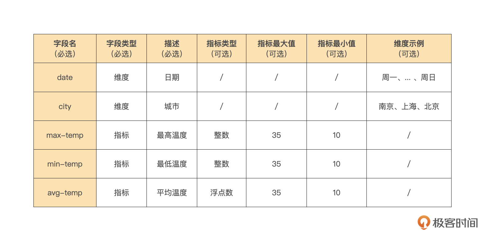
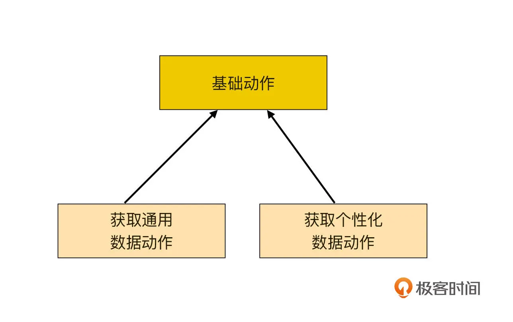
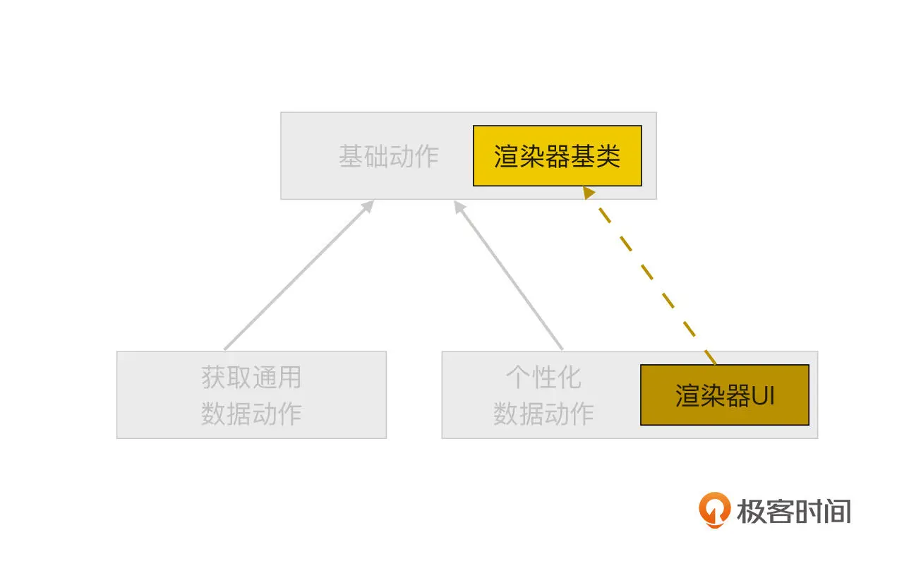
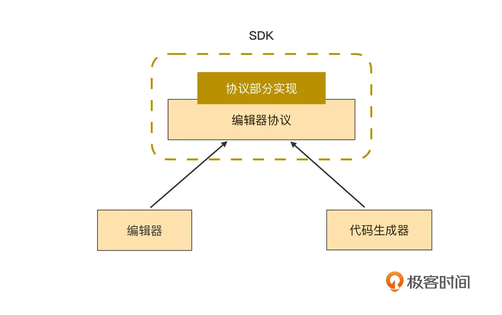
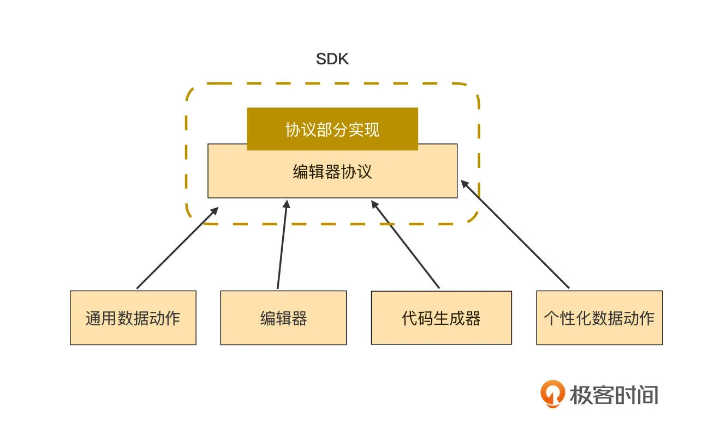
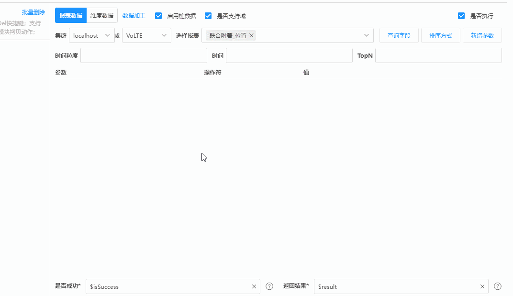

# 12 | 业务数据：再好的 App，没有数据也是白

今天我们来说说 App 开发过程中获取数据的配置。

数据配置是应用开发三部曲（布局、交互、数据）中的第三个环节，根据 App 的不同，它与数据之间的关系也不同：有的 App 可以产生数据（信息采集类）；有的 App 则是数据消费者，或者兼而有之。数据采集 + 推送，包括文件上传的方式总体来说都比较简单，不在今天的讨论范围内，这一讲我们主要讨论**组件如何获取和渲染数据**。

而且，由于我们这个专栏所说的低代码平台生成的 App 都是 B/S 架构的，App 首选的获取数据方式当然是 HTTP 通道，实际上，即使是 C/S 架构的 App，HTTP 通道也依然是一个非常好的选项。所以，这一讲我们就只讨论通过 HTTP 通道来获取数据的情况。

## 请求参数、数据结构修正、数据模型

我们先来讨论数据获取的最基本动作，从请求发出去到数据展示到 UI 上，全程会涉及参数设置、返回的数据结构修正、数据模型映射等几个主要环节。

你要注意，这几个环节不包含获取数据的异常处理流程。异常处理是相对简单的一部分，只要别忘了在配置界面上增加对应的出错处理配置，生成的代码注意捕获 HTTP 异常即可。

**第一个基本动作是 HTTP 请求的参数配置。**HTTP 协议允许我们在多个不同的位置设定参数，可能传参的位置至少有三处：通过 url 传参、通过请求头传参，通过请求 body 传参。你在设计参数配置界面的时候，别忘了要给这 3 个可能传参的位置留出配置界面。

其中 url 传参这块是很容易被忽略的。比如下图的配置界面中，很容易把 url 输入框作为静态文本输入：


这样的话，应用开发要通过类似下面这样的 url 传参，就不行了：

```shell
# $v1 和 $v2 都是变量
/some/data/url?p1=$v1&p2=$v2
/some/data/p1/$v1/p2/$v2
```

我的解决方法是，支持类似模板字符串的语法，即在 url 输入框中填写这样的 url，表示包含变量：

```shell
/some/data/url?p1=${v1}&p2=${v2}
/some/data/p1/${v1}/p2/${v2}
```

其次，url 传参还有一个容易被忽略的问题：url 编码。

比如前面例子中的 v1 或者 v2 变量，如果运行时，变量值包含敏感字符如“&”，或者包含汉字，此时拼出的 url 会出错，导致请求失败。解决方法也很简单，我们只需要解析应用开发给的 url，自动添加编码函数，即在实际生成的代码中，自动把应用开发填写的 url 自动处理为：

```shell
/data/url?p1=${encodeURIComponent(v1)}&p2=${encodeURIComponent(v2)}
/data/p1/${encodeURIComponent(v1)}/p2/${encodeURIComponent(v2)}
```

不过，在处理时，我们也不能无脑处理，因为有的应用开发有这方面的编码经验，有可能他填进来的 url 就已经有包含了 encodeURIComponent 的调用了，此时如果我们再编码就错了。真是操碎了心，有没有！

而且，我们通过请求头传参时也要注意参数值的编码，但通过 body 传参就不需要了，HTTP 传输层会自动编码。

配置了正确的参数之后，数据应该就可以拿到手了。如果服务端给的数据结构不符合预期，我们还需要对数据做加工，又或者，如果你打算把拿到的数据做可视化渲染，比如渲染成各种图形，则还需要做数据模型映射。接下来我们将这两个动作放一起考虑。

前端组件普遍对输入的数据的结构有预设。有的要求输入的数据必须是一个一维数组，有的则要求具有特定结构，比如 Jigsaw 的表格要求输入这样结构的数据：

```js
{
    header: [ "Column1", "Column2", "Column3" ],
    field: [ "field1", "field2", "field3" ],
    data: [
        [ "cell11", "cell12", "cell13" ], //row1
        [ "cell21", "cell22", "cell23" ], //row2
        [ "cell31", "cell32", "cell33" ]  //row3
    ]
}
```

通用性较高的低代码平台对接的服务端往往是无法事先预知的，所以对方返回的数据结构也是无法预知的。这要求在前端收到数据之后，要有数据结构如何做转换的配置。数据结构修正尽量自动完成，这样可以减少应用开发的配置工作量，以及降低应用开发的难度。一个比较好的方法是，尽可能收集各种可能的输入数据结构，然后根据特定输入结构，设定参数，从而可以达到自动生成转换代码的目的。

我这里给出两种比较常见的输入数据结构，分别是二维表结构以及准二维表结构。虽然现在服务端持久化数据的方式多种多样，但大多数还是采用 RMDB 来存储，所以服务端从数据库中读取到的原始数据，多数就是二维表结构的：

```js
[
  ["v11", "v12", "v13", "v14", "v15"],
  ["v21", "v22", "v23", "v24", "v25"],
  ["v31", "v32", "v33", "v34", "v35"],
  ["v41", "v42", "v43", "v44", "v45"],
  ["v51", "v52", "v53", "v54", "v55"],
];
```

另一种是二维表的变体，如果服务端用的是 node.js 实现的，很可能会返回这样的数据结构：

```js
[
  { f1: "v11", f2: "v12", f3: "v13", f4: "v14", f5: "v15" },
  { f1: "v21", f2: "v22", f3: "v23", f4: "v24", f5: "v25" },
  { f1: "v31", f2: "v32", f3: "v33", f4: "v34", f5: "v35" },
  { f1: "v41", f2: "v42", f3: "v43", f4: "v44", f5: "v45" },
];
```

当然，这里还需要有兜底方法，用于处理预设类型之外的其他情况。但在这个情况下，只能编写数据转换逻辑了。我们可以引入第 10 讲的方法，通过可视化编程方式来编排转换逻辑，也可以直接给一个编辑器，让应用开发填写转换逻辑。两种方式的流程都是一样的，都是给出一个原始数据，要求应用返回一个处理后的数据：

```js
origin => {
    // 把你的处理逻辑放在这里
    const result = ...;
    return result;
}
```

如果说数据结构是对数据的一种逻辑表达，那么数据模型则就是对数据的一种抽象化描述。

数据建模往往与业务强相关，根据特定的业务模型来对数据做抽象和归类，这也就导致了不同业务可能会使用不同的模型来描述数据。我这里给出的是我们用于描述电信领域相关业务，特别是运营商大数据相关业务的数据模型，多年的应用表明在这个业务下有非常好的表现。实际上，这个模型是可以推广到所有采用 RMDB 来持久化的关系数据的。


这个模型把数据库表的所有字段，分为维度和指标两类。维度是描述一个事物的各个实体，比如省市区这 3 个维度可以用于行政区，再比如手机厂商、手机型号也是维度，以此类推。

指标就更好理解了，绝大多数的指标字段都是数值型的，比如今天的温度、这篇文章的字数，以及新冠确诊人数等。有的指标是可枚举的值，虽然不是数值型的，但也是指标，比如考核等级 S/A/C。时间是一个比较容易混淆的字段，它看起来是数值型的，但我们将时间作为维度来对待。

在对数据可视化渲染时，数据模型可以帮助低代码平台大幅降低数据可视化配置界面的复杂度，也可以让数据可视化配置过程更加具有业务含义，提高配置效率，减少试错次数。所以，在配置应答数据的结构时，我们还要把这笔数据用作可视化渲染，还必须要求应用开发填写必要的数据模型信息，越详细越好。

比如下面这个表格，就是描述一份天气数据的模型：



## 数据打桩

接下来，我们再谈谈另一种获取数据的方式，也就是在开发态下获取数据的各种骚操作，我们可以偷，可以抢，甚至可以造假。

App 在开发时，一个非常普遍的情况是，它的数据还没准备好，或者不在当前开发环境下。总之，就是**没有数据可用**，那低代码平台应该如何帮助 App 开发者解决这个问题呢？

数据打桩就是解决这个问题的功能。

数据打桩的基本实现是给一笔假数据作为模拟。实现的方法非常简单，就是给 XHR 请求加一个拦截器，通过 url 等筛选出需要模拟的 rest 服务，然后直接造假。这样甚至可以做到在不实际发出 XHR 请求的前提下，实现数据打桩。

更进一步，你可以让应用开发配置一定的规则，比如参数 A 的值是 a1 时，返回数据 1，值是 a2 时，返回数据 2，甚至直接让应用填写模拟的代码，这样理论上可以 100% 模拟服务端。采取哪种方式，取决于你需要模拟到啥程度。

那么，我们如何加 XHR 拦截器呢？其实多数前端框架都有解决方案了：

- 如果你使用的是 VUE/React，一般会使用到 axios 来处理 XHR 请求，axios 有 interceptors 属性，可以用于你添加拦截器；
- 如果你用的是 Angular，那可以直接使用 HttpClient 提供的拦截功能；
- 如果你使用的是 jQuery，可以通过 ajaxSetup 这个函数来设置拦截器。

如果你啥框架都没用，那有没有办法拦截呢？

当然也是有的，你可以直接对浏览器原生的 XmlHttpRequest 打补丁，下面这段代码演示了如何换掉 XmlHttpRequest 的 send 函数：

```js
const originSend = XMLHttpRequest.prototype.send;
XMLHttpRequest.prototype.send = function (body) {
  var info = "send data\r\n" + body;
  alert(info);
  originSend.call(this, body);
};
```

我们的低代码平台 Awade 为了让打桩代码更加真实，就没有采用上述任何一种方法，而是在直接把桩代码生成到服务端，这样前端就不需要做任何处理了，只需要把 url 重定向到 Awade 生成的桩代码即可。

不过，仅仅有数据模拟是不够的，虽然我们可以把服务端模拟得很像，但是会多出很多无价值的配置。因此，在 App 开发的中后期，直接模拟的方式会被抛弃，改用把请求重定向到真实服务端去。此时所谓“真实”服务器，其实是指某位后端开发人员办公电脑，或者是另一个低代码服务器实例。

这里有个背景需要注意，我们鼓励应用团队自行部署 Awade 私服，而不是都集中到 Awade 官服上开发，主要是因为官服容量不够，所以在中兴内部有许多的 Awade 私服存在。这就造成了同一个 App 可能分开到两个私服上开发。

使用 web 服务器（如 Nginx）的反向代理功能来实现服务重定向，是非常容易的，但会有一个棘手的问题，就是往往低代码平台只有一个 web 服务器进程，不同应用需要重定向到不同的服务器，即使无视转发规则冲突的问题，但让转发规则生效时的 reload 操作也是无法容忍的。因为 reload web 服务器的配置会导致进行中的其他请求瞬断，这是无法接受的。

那可否不经过服务端，绕一圈，直接从低代码平台服务器一个请求到目标服务器上去读取数据呢？

在解决了跨域问题的前提下，是可以的。本来，跨域问题并不难解决，在服务端配置一下 CORS 策略就可以轻松解决。但这隐含了一个前提，就是你要先知道有哪些服务端，对吧？问题就在于你有可能不知道有哪些服务端！比如我们的低代码平台 Awade 是一个开放性的平台，在它上面开发的 App 的数据来源自然是无法事先预知的。这个情况下，跨域问题似乎是无解的。

曾经，我也是这么认为的。不过，在走了一段弯路之后，终于找到了一个方法，可以在不配置服务端 CORS 策略的前提下，巧妙地“骗”过浏览器，绕过跨域限制，做到在浏览器中可以跨域请求任何服务器数据的效果。

这个方法有点绕，我会在这门课的动态更新部分，尝试只用一讲把这个方法说清楚。无视跨域约束地请求任何服务器数据，是通用型低代码平台的一个很有意义的能力。

## 个性化数据

前面我们详细讨论了低代码平台通过可视化方式获取数据的方法、数据模型、模拟数据等，这些都是着眼于通用的获取数据和处理数据的方法。接下来，我们再来说说如何处理个性化数据。个性化数据的通用性低，一般只适用于某个特定的业务场景，这就造成了个性化数据的获取方式形式多，数量大。

**插件机制是低代码平台处理这种情况的最佳选择。**

得益于个性化数据只为特定业务设计的特点，我们可以采用比通用数据更加灵活的方式来获取数据、提取模型和模拟。一个插件只专注处理好一种个性化数据就行，不需要考虑除此之外的其他场景，因而插件的实现难度低、效率高。

接下来，我们再看看采用啥架构可以让低代码平台支持通过插件的定制，获取个性化数据。思路和第 9 讲类似，因此为了更好的学习效果，你可以回顾一下第 9 讲看看我们是如何做出第一个插件的。部分相似思路这里我就简略带过，不再和第 9 讲那样详细说明了。

首先，我们把获取数据看作是一个动作。

说到这里，可能你已经想到了，无论是获取通用化的数据也好，个性化数据也罢，都是获取数据动作的一种具体实现。此时我们可以画出这样的一个图来：



基础动作里包含的是两种动作的共同部分。都有哪些呢？至少包含这几部分内容，一是信息采集，一是信息保存，一是代码生成。

**信息采集，就是要定义一个收集开发者配置信息的视图。**获取数据的各个动作，需要采集的信息都大不相同，不同的个性化数据需要采集的信息也各不一样。因此，在基础动作中，这部分是抽象的，我们无法知晓具体该绘制啥样的 UI，但可以约束具体动作采用什么方法来绘制 UI，比如你可以要求动作子类采用 jQuery 的方式，或采用 MVVM 框架的动态渲染器的方式。

我采用的是后者，子类可以将处理 UI 的所有逻辑，都封装到动态渲染器中。并且得益于 TypeScript 特性，我还可以为各种渲染器组件提供一个父类，以减少子类开发时的难度和编码量。此时渲染器与基础动作之间会形成下图这样的关系：



**信息保存是可以在基础动作中直接实现的**，只需要在基类中提供读写数据的 API 给子类使用即可。注意，在基础动作中不能定义一个具体的配置数据结构，这个结构必须由子类自行定义。在动作子类的渲染器中，我们就可以使用基础动作提供的配置数据读写 API，将 UI 上采集到的数据统一存到基础动作中去了。

你可能会有这样的担忧：既然配置数据存储的结构不能由基础动作决定，那在生成代码的时候，基础动作无法知晓配置数据的结构，自然就无法生成代码了。

其实，这个担忧是不存在的。和第 9 讲使用的方法一样，基础动作只能定义代码生成的过程，但是它无法定义具体如何生成代码，这对基础动作来说是抽象的，只能在动作子类中实现。这个过程我这里就一带而过了，如果你还是无法理解，请回顾一下第 9 讲，或者在评论区提问。

最后，把基础动作的代码合并到下图的编译器协议中，成为 SDK 的一部分。



通用获取数据的动作，作为基础动作的一种默认实现，由低代码平台提供官方的实现，个性化获取数据动作则作为一个新的插件，由业务团队实现。此时的架构图如下：



当然，并不是说个性化获取数据动作只能由业务团队来实现，实际上低代码平台团队也可以提供一些个性化数据动作的插件实现。

一般在低代码平台推广初期，平台团队为了减少在业务团队中推广的阻力，会主动将业务团队常用的获取数据方式做成插件给他们使用，从而解决低代码平台与业务团队存量系统的对接问题。可以看到，在这个过程中， 插件起到一种类似胶水的作用，它可以很好地将低代码平台与存量系统粘在一起。

下面，我们再看一个实例，对比下通用和个性化获取数据的差异。对于同一笔数据，如果它在低代码平台中只能采用通用化方式来获取，我们可以看到参数部分非常复杂，要正确填写这样的参数是不容易的：


但在业务团队，却可以在插件中，开发出这样的定制化 UI 来获取同一笔数据：



上面这段动画操作完成之后，插件会自动生成第一个图中的参数。采用这样的形式来获取数据谁不爱呢？

当然，除了采用插件化来定制个性化数据之外，我们还可以用其他形式获取个性化数据，比如可以采用 DAG（Directed Acyclic Graph，有向无环图）的形式来对数据做可视化编排。

不过，这讲说到现在，我们都是假设数据一次性就可以拿到手，但有时候实际情况并非如此。比如 Awade 曾经处理过这样一个业务需求：一个趋势图展示某个指标，它的数据有一部分来自历史数据，一部分来自实时数据。

对大数据有了解的小伙伴应该都知道，由于数据量过大，任何大数据系统都会把历史数据和实时数据分开，采用完全不同的方式来处理，而客户要求在一个趋势图上显示这两种数据，这就需要在后台分别读取两种数据之后，将其拼在一起。这个情况下，我们就需要用上可视化数据编排来获取深度定制的个性化数据了。

这讲我们就不展开可视化数据编排的具体实现了，我找机会再专门聊聊这个内容。

## 总结

这一讲主要专注在低代码平台如何在 App 开发过程中获取数据，从通用和个性化两个角度详细讨论了低代码平台数据的获取。通用方式获取数据的方式，可以适用于大多数 App 的开发过程，但需要对获取到的数据结构进行修正，以及无法预设获取到的数据的模型。因此，在对这个方式获取的数据进行可视化渲染之前，我们还必须配置数据的模型，以降低配置图形可视化渲染的难度，使得图形配置过程更具有业务含义。

有的企业做了中台化改造，在改造完成的部分，低代码平台通过中台统一获取数据就可以省去非常多的麻烦，包括数据结构和数据模型。数据中台往往会对数据进行治理，在治理完成之后，数据中台就可以给出结构统一的数据，给低代码平台开发者使用了。同时，数据中台在数据治理后，还可以将数据的模型作为资产，提供统一的 API，低代码平台通过数据资产 API 就可以获取到数据模型的信息了。我在第 1 讲中提到，中台和低代码的演进线路有相当一部分是重合的，这就是一个例子。

使用个性化数据的体验往往会比通用化数据要好得多，可以实现更加彻底的可视化方式来使用数据。但是个性化数据的获取需要有大量的定制化配置，这就要求低代码平台必须提供一套插件机制来支持业务团队在获取个性化数据方面的定制需求。这讲中，我结合第 9 讲的知识，扩展出了一种新的插件定制架构和方法，基于这些思路，你应该可以做出个性化数据定制机制和二次开发插件的方法了。

最后，低代码平台还需要提供数据打桩的方法，帮助应用在无法直接获取到数据的情况下，可以基于模拟或者转发的方式来获得数据，使得 App 的开发得以继续。
